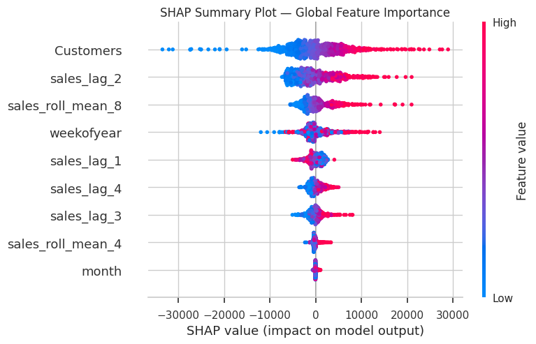

🏬 Rossmann Sales Forecasting (XGBoost + SHAP Explainability)

This project builds an **end-to-end weekly sales forecasting model** for Rossmann retail stores using:

- **XGBoost** (final model — high accuracy)
- **SHAP explainability** (global + local)
- **Time-series feature engineering**
- **6-week ahead forecasting**
- **Fairness analysis across stores**

The goal is to create a transparent, reliable, and practical forecasting pipeline that can support staffing, inventory planning, and revenue decisions.

🚀 Key Features

1. Data Processing & Weekly Aggregation
- Daily sales → Weekly sales  
- Lags (1–4 weeks)  
- Rolling averages (4–8 weeks)  
- Time features (week, month)

2. Model Building
Two models were tested:
- **Random Forest**  
- **XGBoost (Final choice)**  

XGBoost performed best with:
- **R² ≈ 0.95**
- Excellent handling of store-level patterns

3. Explainability (SHAP)
- **Global feature importance**
- **Local explanations** for individual predictions
- Helps business users understand *why* predictions change

4. Fairness & Bias Check
- Per-store MAE analysis  
- Identify stores where the model performs unusually poorly  
- Supports fair and responsible decision-making  

 5. Forecasting
- Generates **6-week ahead predictions** for all stores  
- Uses iterative forecasting with updated lag features  

---

📂 Repository Structure

### 🔍 SHAP Explainability Preview

